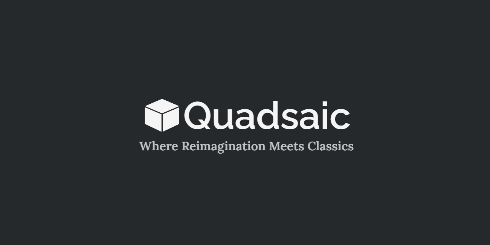
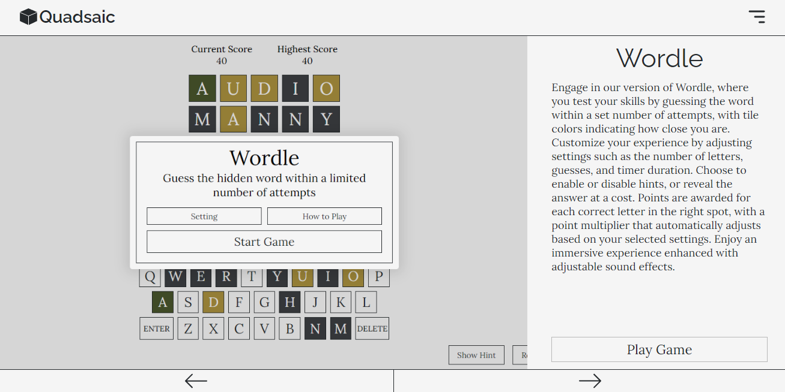
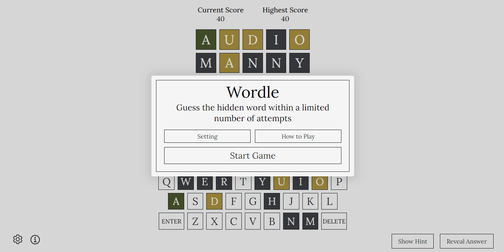
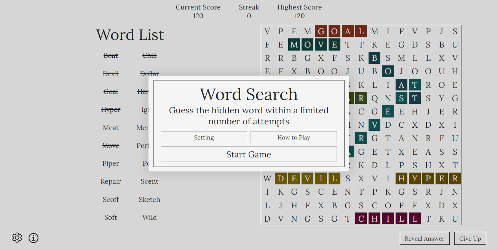
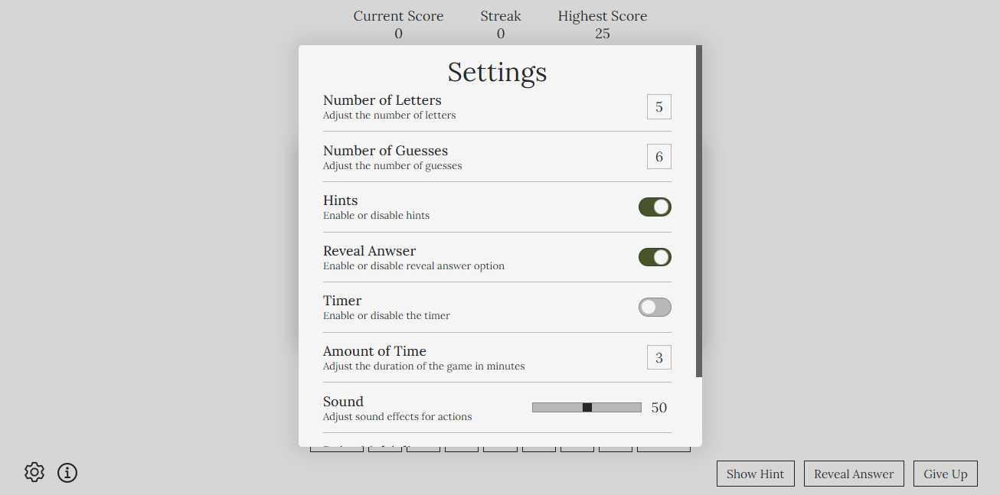
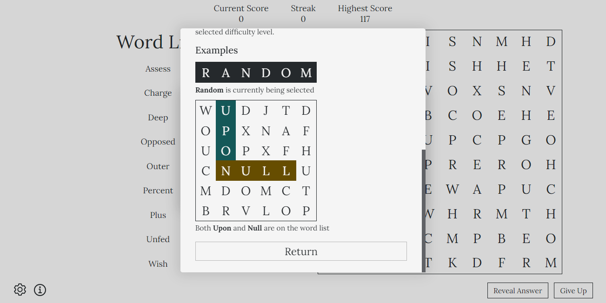

# Quadsaic
A game hub featuring two popular games: Wordle and Word Search. Each game is enhanced with unique customizations to provide a fresh and engaging experience while retaining the charm of the originals.

## Table of Contents
- [TODO](##TODO)
- [Access](#Access)
- [Installation](#installation)
- [Features](#features)
- [Tech Stack](#tech-stack)
- [Screenshots](#Screenshots)
- [License](#license)

## Access
Accessible from https://quadsaic.vercel.app

## Installation
1. Clone the repository: git clone https://github.com/Ama4538/Quadsaic.git
2. Install dependencies: npm install
3. Run built in script: npm run build
4. Open on localHost: npm run preview

## Features
- Wordle
    - Customizable Settings: Adjust the number of letters, guesses, and timer duration to tailor the game to your preferences.
    - Hints and Reveal Options: Choose to enable or disable hints, or reveal the answer at a cost.
    - Dynamic Scoring: Points are awarded for each correct letter in the right spot, with a point multiplier that adjusts based on your selected settings.
- Word Search
    - Customizable Settings: Adjust timer durations, guess limits, and grid sizes to fit your play style.
    - Reveal Answer Feature: Highlight a randomly selected word that hasn't been found yet. This will cost you points and reset your streak.
    - Build Streaks: Complete multiple game boards consecutively to earn bonus points.
- General
    - Tutorial: All games come with a simple tutorial on how to play.
    - Sound Effects: Enjoy immersive gameplay with adjustable sound effects.
    - Responsiveness: Please note that the app is currently not responsive and is best viewed on desktop devices.

## Tech Stack
- React
- CSS

## Screenshots

## License
Distributed under the MIT License. See `LICENSE` for more information.